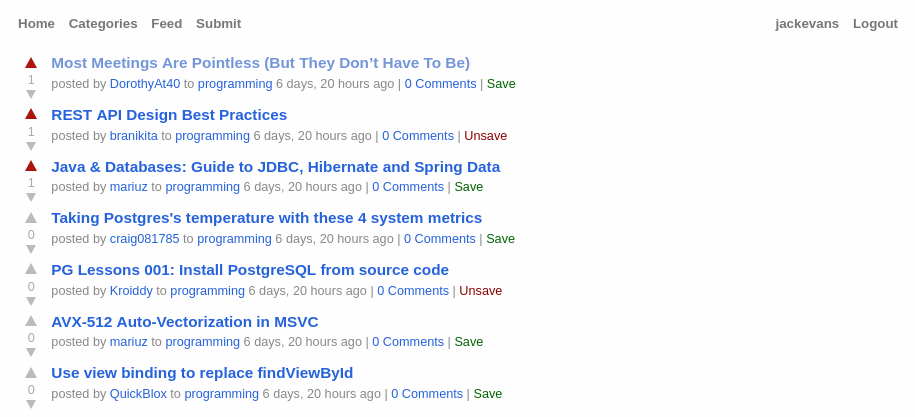

# Jedit

Little hobby project I'm working on, just to see how quickly a very basic
reddit clone would be to build in Django.

### Features
- Post voting
- Post saving
- Category subscription
- Comment permalinks
- Commenting

## [TODO]
- [ ] Account creation
- [ ] Comment voting
- [ ] Comment favourites
- [ ] Custom post ordering (i.e. hot/new)
- [ ] Category creation
- [ ] Tests
- [ ] Rest API (for external clients)
- [ ] Category moderation? 
